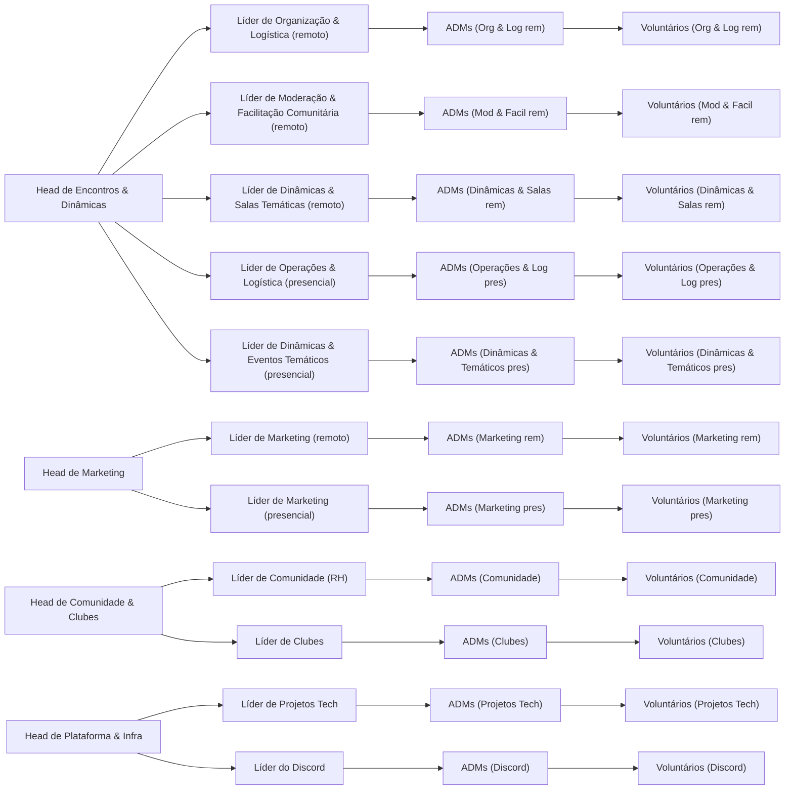

## Navegação rápida

- [Heads](./heads) - Heads do SpeakUp Community, responsáveis por organizar e coordenar as atividades da comunidade.
- [Líderes de Área](./area-leads) - Líderes que supervisionam áreas específicas dentro da comunidade.

## Diagrama da hierarquia

Os componentes do diagrama são clicáveis e levam a seções específicas da documentação.

 

